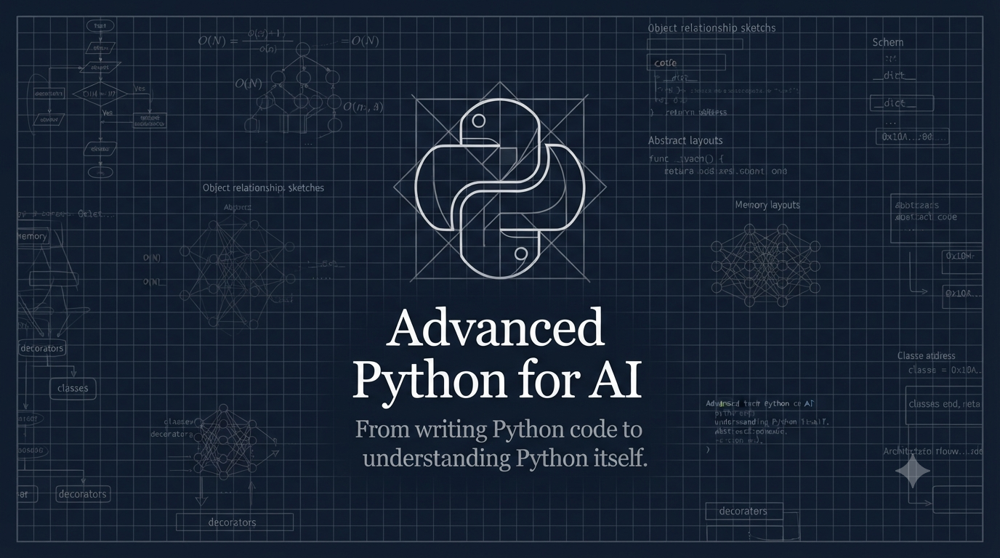

<p align="center">
  
</p>

<h1 align="center">Advanced Python for AI</h1>

<p align="center">
From writing Python code to understanding Python itself.
</p>

---

## Overview

**Advanced Python for AI** is an open-source handbook designed for developers who want to move beyond Python syntax and understand how the language works internally.

The goal of this project is to bridge the gap between writing Python code and understanding the design decisions, object model, memory management, performance characteristics, and engineering principles behind modern Python.

Each chapter combines theory, implementation details, practical examples, performance analysis, interview preparation, and real-world applications in Artificial Intelligence, Machine Learning, and Data Science.

---

## Who is this handbook for?

This handbook is intended for:

- Python Developers
- Machine Learning Engineers
- Data Scientists
- AI Engineers
- Software Engineers
- Computer Science Students
- Anyone who wants to master Python beyond the basics

---

# Table of Contents

## Part I — Python Internals

| Chapter | Topic | Status |
|----------|------|--------|
| 01 | Python Data Model & Object Internals 
| 02 | Functions as First-Class Objects, Closures & Decorators 
| 03 | Iterators, Generators & Lazy Evaluation 

---

## Part II — Professional Python

| Chapter | Topic | Status |
|----------|------|--------|
| 04 | Memory Management, References, Garbage Collector & Performance 
| 05 | OOP Beyond Basics (MRO, Mixins, ABC, Protocols, Magic Methods) 
| 06 | Concurrency (Threading, Multiprocessing, AsyncIO) 

---

## Part III — Python Engineering

| Chapter | Topic | Status |
|----------|------|--------|
| 07 | Typing, Dataclasses, Enums & Modern Python 
| 08 | Performance Optimization 
| 09 | Design Patterns & Clean Python Architecture 
| 10 | Python for AI & Data Science 

---

# Repository Structure

```text
advanced-python-for-ai/
│
├── assets/
│   └── banner.png
│
├── 01-python-data-model-object-internals/
├── 02-functions-first-class-closures-decorators/
├── 03-iterators-generators-lazy-evaluation/
├── 04-memory-management-performance/
├── 05-advanced-oop/
├── 06-concurrency/
├── 07-modern-python/
├── 08-performance-optimization/
├── 09-design-patterns-clean-architecture/
├── 10-python-for-ai-data-science/
│
├── README.md
└── LICENSE
```

---

# Learning Philosophy

This repository is not about memorizing Python syntax.

It is about understanding:

- how Python works internally,
- why certain language features exist,
- when to use them,
- how to write clean and maintainable code,
- how Python is used in production AI systems.

The emphasis is on conceptual understanding rather than rote memorization.

---

# Project Goals

By completing this handbook, you will be able to:

- Understand Python's object model.
- Write idiomatic and Pythonic code.
- Optimize memory and performance.
- Build maintainable software.
- Master advanced language features.
- Apply Python effectively in AI, Machine Learning, and Data Science.
- Prepare for advanced Python technical interviews.

---

# Contributing

Suggestions, corrections, and pull requests are always welcome.

If you find this project useful, consider giving it a ⭐.

---

# License

This project is licensed under the MIT License.
